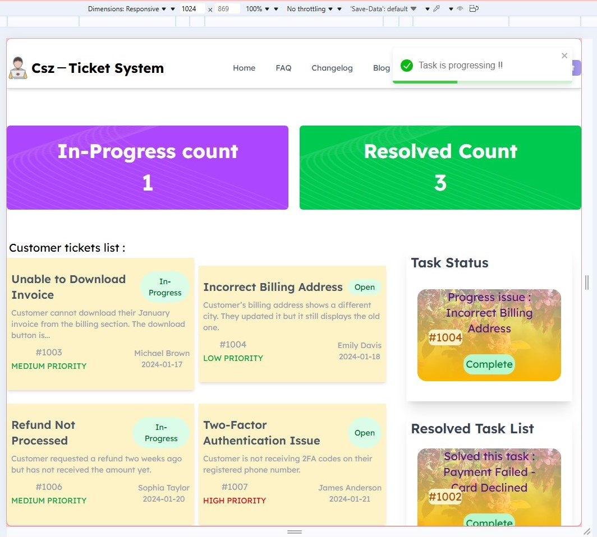
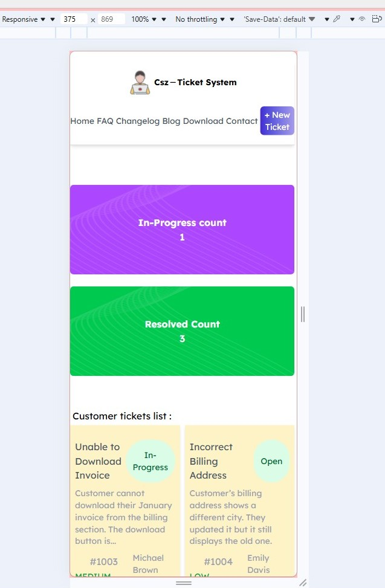

# React Project - Customer Support Zone

-  
-  

## React Compiler


##  Answers

 - What is JSX, and why is it used?
  *JSX(JavaScript XML) is a syntax extention for JavaScript in React that lets us write HTML like code inside JavaScript Example:*
  ```
  javaScript:
  const element = <h1>Hello, world</h1>
  ```
  *This code is late compiled in regular javaScript*
  
 - What is the difference between State and Props?
 - What is the useState hook, and how does it work?
 - How can you share state between components in React?
 - How is event handling done in React?
